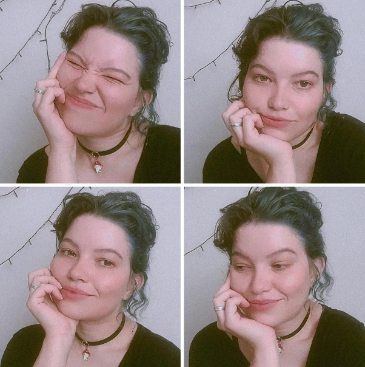

## Aoba! Bão? ≽^•⩊•^≼

[](https://www.instagram.com/bridgetocross/)
[](https://www.linkedin.com/in/btrz/)
[](https://m.twitch.tv/bridgetocross)
[](https://open.spotify.com/user/22agzvjyx4zninl5oba3tfcty?si=57d6fa61699c4dad)
[](medium.com/@bridgetocross)

## 💾 Stuff  /ᐠ - ˕ -マ

HackerRank: https://www.hackerrank.com/profile/bridgetocross

Microsof Learning: https://learn.microsoft.com/pt-br/users/bridgetocross/

Codepen: https://codepen.io/bridgetocross

Behance: https://www.behance.net/bridgetocross

Devianart: https://www.deviantart.com/losingmybridge

YouTube Channel: https://www.youtube.com/@descongestionante_nasal

Patreon: https://patreon.com/btrz

<br/>

## 📕 Organized List of Projects at this Github ✨
Yeah, I know how sucks to go into someone's github and wonder: what repo should I open?<br>
So as Jack the Ripper would say: let's go by parts! 🔪

<details>
  <summary>👩‍🎨 <b>Master Pieces</b> - current projects </summary>

  <small>Esses projetos são minhas Monalisas 💖 Por que são bons? Não, porque não entreguei até hoje a versão final ✨</small>

  <small>Todos os projetos abaixo são os que trabalho frequentemente, então se você quer saber como eu codo atualmente, olhe esses projetos:</small>
  
  | Master piece name | Project Type | Techs used | Git Repo   |
  | ----------------- | ------------ | ---------- | ---------- |
  | Portfolio         | Site         | PHP/Laravel | [https://github.com/tocrossbridge/portfolio] |
  | Gerencia minhas despesas |   App | Angular | [https://github.com/underdogbytes/angular-gerencia-minhas-despesas] |

</details>
  
<details>
  <summary>🧙 <b>My wild lab</b> ⚗️</summary>
  Demonstrating that I know how to use some libraries, just like:

  | Lib's name     | Project Type | Techs used | Git's Repo |
  | ----------     | ------------ | ---------- | ---------- |
  | Readline-sync  | Using lib    | Readline-sync  | [https://github.com/tocrossbridge/readline-sync] |
  | Shopping cart  | E-commerce   | JavaScript | [https://github.com/tocrossbridge/carrinho-compras] |
  | Tamagotchi     | Game         | JavaScript | [https://github.com/tocrossbridge/tamagotchi] |

</details>

<details>
  <summary>🖌️ <b>CSS Arts</b> - drawings with CSS</summary>
  
  Idk, sometimes I just wanna prove to myself that I can do some stupid shit only using CSS ^-^''

  (ou como diria um antigo colega de faculdade: provar que é virgem e que não sai de casa)

  | Description     | Git's Repo |
  | --------------  | ---------- |
  | Transforming boring person in Blink 182 fan | [https://github.com/tocrossbridge/blink_guy] |
  | It's a pizza | [https://github.com/underdogbytes/pizza] |

</details>

<details>
  <summary>🤓 <b>Free Knowledge</b> (e gabaritos FREE.99)</summary>

  | Description     | Git's Repo |
  | --------------- | ---------- |
  | Descomplica gabaritos - College Descomplica answer sheets | [https://github.com/tocrossbridge/descomplica-ti]

</details>


## 🪐 About me 🦕🌠 

UI Designer | Software engineer | Idk man LoooL 📺🕹️📷🌱🐛

Hellow ma beloved oness! :D

Well, I'm 27 years old right now, is it been a long time, huh? ≽ ^ • ⩊ • ^ ≼

Nowadays I'm studying 2 courses at college at the same time, drinking more water, exercise a little and being a great time offline. Oh yeah, I still don't make plans for my life hahaha ^-^ I just try to be better than I was yesterday always respecting my own limits.

And perhaps life is this simple and don't need more complicated stuff. And talking about complicated stuff, did you believe me if I said that I started enjoying resolving math problems? hahaha Idk why yet, but it's been fun ^-^

About work, yess, I still only working to pay my bills, prioritizing my mental health above my job, so, yeah, "I'm getting older and I think I'm aging well" hahaha ¸ ¸ ♬ · · ♩ ¸ ¸ ♪ •°

My motto still

```
𝘛𝘩𝘦𝘳𝘦'𝘴 𝘯𝘰𝘵𝘩𝘪𝘯𝘨 𝘣𝘶𝘵 𝘵𝘩𝘦 𝘦𝘮𝘱𝘵𝘪𝘯𝘦𝘴𝘴.
```

but also 
<br>
<br>


Ẁ̵͙̻̝͝͝ͅh̶̠̜̒͊̔͛̆̃̉ǎ̵̡͓͕̯͖͍͉̤̝̒ͅt̸̛̪͔̹̳̙̔̆̎̊̅̈́̐̾é̸̱̠̺̤̐̓̅̋̋͒͋͒͝v̷̗͍̺̣͒̏̊̊̀̕ḛ̵͇̺̈́̋̀͌̓̄ŗ̵͎͉̇͠ ̸̜̝͍̭͈̈́̀͒̔͝h̷̬͚̼̦̑͛̆̊͒̚͜ą̸̨̗̬̦͓̩̺̤̟̔́p̸̪̏̇̽p̵̭̘̼̆͗͆̆̔̚͜e̴̢̡͓͓̖͚͕͆̓̔̀͊͒̃n̶̝̉̌̄̋́̚̚s̴̗̦̞̥͚̻̼̣͂͛͂̀͂,̶̢̘̻̫͓͎̺̞̞̍̀̎̌̂͘ͅ ̶̣̱͖̰̤̺̹̳̣̈̎̀̿͒̔̉̒͜ḩ̸̠͙͖͉̥̎̓̂͂̃̍͋͘͜͜͝͠a̴̝͐̀͘͠ͅp̸̡̪̬̰̱̺̩̹̓p̴̥̫͊́̑̈̔͘̕e̴̹̠̬͉͋̿n̶̺̱̳̯̩̍̎̐̏̕s̶̪̟̃͐̆͋͑̆̔̈́͝.̴̮͚̿̌͒̓͒̉̋

<br>
<br>
Yeah yeah, I know ˜”*°•.˜”*°•  I'm cringe but I'm free •°*”˜.•°*”˜

<br>



Oh, I was almost forgotting, I love this song:

▶• ılıılıılıılıılıılı.
